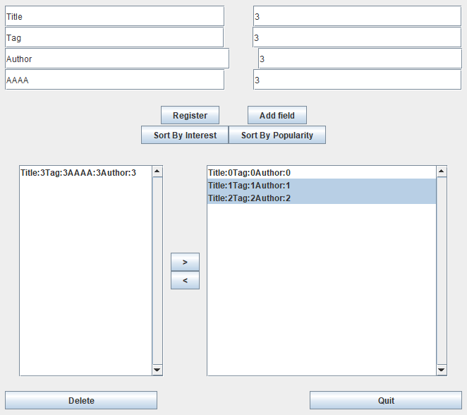

# book_management_tool

To test the bookInterface, use the below command for CMD.
For some kind of reason you can not compile nor run the script through powershell.

## Command Prompt:
```bash
javac -cp .;Recommend.jar Test.java
java -cp .;Recommend.jar Test
```

## 使用方法

コンパイルする際、CMD上であれば`run.bat`が使用することができる。他のシステムであればクラスパスの分割要素`;`から`:`に変化すればよい。

```cmd
echo Starting...
cd book_manager/bookInterface
javac -cp ../../;/book_manager/bookInterface *.java
echo compiled bookInterface
cd ../buttonsUtil
javac -cp ../../;/book_manager/buttonsUtil *.java
echo compiled buttonsUtil
cd ../../
javac -cp .;Recommend.jar InterestButtonAction.java
javac -cp .;Recommend.jar PopularityButtonAction.java

javac -cp .;Recommend.jar GUITest.java
java -cp .;Recommend.jar GUITest.java
```

テキストフィールドを増やし、本の情報を増やすことが可能かつそれぞれの本が任意の長さの情報列を持つことが可能。Recommend.jarからのソートはSort By InterestとSort By Popularityによって可能。複数選択し>と<ボタンによって要素の移動が可能、また削除においても複数選択可能。



## package bookInterface

`Element.java`を要素、`Aggregation.java`を集合体としてのインターフェースをまず用意し、それぞれ`Book.java`、`BookShelf.java`で実装するようにした。この時Element内ではなにも抽象メソッドを持たせていないため、インターフェースとしての役割はほとんどないが、最終的に本だけでない対象物に対しても用いることができるようにしたいため、とりあえずその準備だけをしておいた。このことは「要素」という単位以上に分割することができないことより、基本的に保持するべき機能が考えつかなかった為である。具体的には今回であれば本には複数のパラメータを考えられるが、場合によってはパラメータは1つであったりとし、抽象メソッドが包括的な名前になることができないため定義は一旦省いた。Elementとは対照的にAggregationでは5つの抽象メソッド、
```java
  public void addElement(Element e);
  public void setAggregation(List<Element> elements);
  public void removeElement(Element e);
  public void removeAggregation();
  public boolean existElement(Element e);
```
を用意した。`addElement`では1つのElementをAggregationに加える事を、`setAggregation`ではAggregation自身をまるごと入れ替える事を、`removeElement`では指定したElementをAggregationから除く事を、`removeAggregation`ではAggregation自身をまるごと削除する事を、そして最後に`existElement`を指定したElementがAggregation内に存在しているかどうかを確認する意味として定義した。
これらの定義は最低限、集合体であれば用意されるべき機能として考え、用意した。

### Book.java

`Book.java`では、`Element.java`を実装している。`Book.java`では`Map<String, String>`を用いてBookの詳細を格納する変数`_detail`を宣言している。これは詳細を示す変数を作ることよりも拡張性を持たせるためである。しかし、このことによって文字列以外の数字などの値を格納するには、使用者側で調整するなどの必要が生じてしまう所は懸念点である。この変数`_detail`を起点として、`Book.java`ではメソッドを実装しており、それらは、
```java
  public boolean addParametre(String key, String value);  
  public boolean removeParametre(String key);
  public boolean modifyParametre(String key, String value);
  public void setBookDetail(Map<String, String> bookDetail);
  public Map<String,String> getBookDetail();
  public boolean existsParametre(String key);
  public boolean equalsDetail(String key, String value);
  public boolean equals(Book b);
```
である。これらは上から、詳細を一つ加える`addParametre`、指定した詳細の一つを削除する`removeParametre`、指定した詳細の一つの文字列を変化を変化する`modifyParamtre`、詳細をまるごと設定する`setBookDetail`、詳細をまるごと取り出す`getBookDetail`、指定した詳細が存在するか確認する`existsParametre`、指定した詳細の内容が存在するか確認する`existsDetail`、本が一致するか確認する`equals`を実装したメソッドである。また、使用するかわからないがほとんどのメソッドがこの時点では返り値の型をbooleanとして、その操作が可能だったかどうかを判別するために付随している。

後からGUIを作成する際に必要になったコードがあったため以下に示す。
```java
  public String toString();
  public void setString2Book(String inputBookString);
```
`toString`では本の詳細として格納されたパラメータを文字列として出力し、また`setString2Book`ではその逆の工程、文字列を受け取りそれを本の詳細としてパラメータに格納する。

### BookShelf.java

`BookShelf.java`では、`Aggregation.java`を実装している。こちらではBookの集合体であるBooksを`List<Book>`で表現しており、また宣言した`_bookShelf`に対して操作を行うメソッドをクラス内では用意されている。以下に`BookShelf.java`内で実装したメソッドを示す。
```java
  @Override
  public void setAggregation(List<Element> books);
  @Override
  public void addElement(Element e);
  @Override
  public void removeElement(Element e);
  @Override
  public boolean existElement(Element e);
  @Override
  public void removeAggregation();
  public List<Book> getBooks();
  public List<Book> filterBooks(String key, String value);
```
これらは上から、インターフェースAggregationで用意した`setAggregation`、`addElement`、`removeElement`、`existElement`、`removeAggregation`、Bookの集合体を格納しているList<Book>を返り値とする`getBooks`、指定した内容のBookの集合体を取り出してくる`filterBooks`を実装したメソッドである。

後からGUIを作成する際に必要になったコードがあったため以下に示す。
```java
  public ArrayList<String> toStrings();
  public String toString();
  public void setStrings2Books(ArrayList<String> inputBooksStrings);
```
`toStrings`では文字列を動的な配列として格納し、`toString`では配列ではなく、全ての文字列を連結したものをパラメータに格納する。また、`setStrings2Books`では動的な配列の文字列を受け取り、それを本のリストとしてパラメータに格納する。

## buttonsUtil
主にコンパイルする場所でGUI関連の様々な種類のクラスが跋扈しているの可読性をかなり低下させているかつ、一つのクラスに役割を持たせすぎ、管理する際にそれぞれのクラスが密接に関係しているためリファクタリングを面倒にさせているため、それぞれのボタンを示すクラスは別ファイルで作成を行い、このパッケージ内に入れた。また他にも、ユーティリティとして、`ListItemMove.java`と`ListModelUtil`が存在する。一つ目の`ListItemMove.java`では以下の静的なメソッドを持つ。
```java
  public static void move(JList<String> from, JList<String> to, BookShelf fromShelf, BookShelf toShelf);
```
このメソッドではJListとBookShelf内の要素を別の同様の型の構造体に移動させる際に、その内容の整合性を保つために存在する。
二つ目の`ListModelUtil.java`では以下二つのメソッドが存在する。
```java
  public List<E> ListModel2List(ListModel<E> listM);
  public DefaultListModel<E> List2ListModel(List<E> list);
```
`ListModel2List`ではListModelを引数として、その内容をListに変換し出力する。`List2ListModel`ではその逆の変換を行う。

以下に`buttonsUtil`の中に入っている他のボタン用のスクリプトを記す。
* DeleteBookButtonAction.java
* GenerateTextFiledButtonAction.java
* MoveElementButtonAction.java
* QuitButtonAction.java
* RegisterBookButtonAction.java

上記のスクリプト上では、GUIの構造を記載するクラス上での内部クラスではなくなっているため、それぞれコンストラクタにおいて、それぞれの機能を満たすために必要な変数の参照を受け取るようにしている。

`DeleteBookButtonAction.java`では、コンストラクタを呼ぶ際に与えた引数のリストと本棚から要素を消すことができる。具体的な実装となっているため、名前もより具体的になっている。

`GenerateTextFieldButtonAction.java`では、新しくテキストフィールドを、テキストフィールドを管理する動的リストに加えることができ、またGUI上の更新を行うことができる。

`MoveElementButtonAction.java`では、コンストラクタを呼ぶ際に与えた引数のリストと本棚間の移動の始点と終点を示し、その間の動きの整合性をとることができる。

`QuitButtonAction.java`では、実行を終了することができる。

`RegisterBookButtonAction.java`では、コンストラクタを呼ぶ際に与えた引数のリストと本棚に新しく要素を追加することができる。

これらの実装部分はまだまだ機能分解し、ボタン自身の実装と、データの動きの部分の実装を別にし、現状よりも多くの拡張性を持たせることはできる。

ここで、本来であれば、buttonsUtil内に含まれていたが、`InterestButtonAction.java`と`PopularityButtonAction.java`はコンパイルの都合上、package内に存在する場合、jarファイルを認識しなかったため、package外に出している。

## 感想

今回は最終的にOOPの考えをうまく活用できるような実装にできず、またインターフェースをフルに活用した設計ができず悔いが残る点が多い。正直GoFのデザインパターンやDDDなどの設計方法を学べる授業が学部3年ででてくると非常にありがたい。